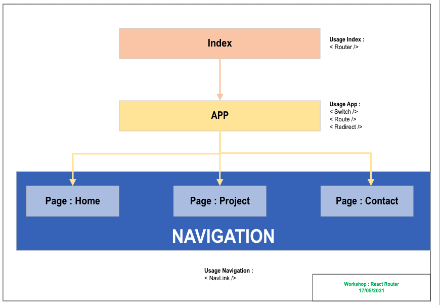

# WorkShop - 17/05/2021 - Live Coding

Site deployed on Netlify : https://workshop-react-router.netlify.app/

## Features :

- Project set up using `react-router-dom` {Router, Switch, Redirect, Route, NavLink}

# 

## Install : 
Repo Git : https://github.com/Imo999/workshop-react-router

```zsh
% git clone git@github.com:Imo999/workshop-react-router.git
% cd workshop-react-router
```

## Install dependencies : 

```zsh
% yarn install
```

### Run the app in the devlopement mode : 

```zsh
% yarn start
```
